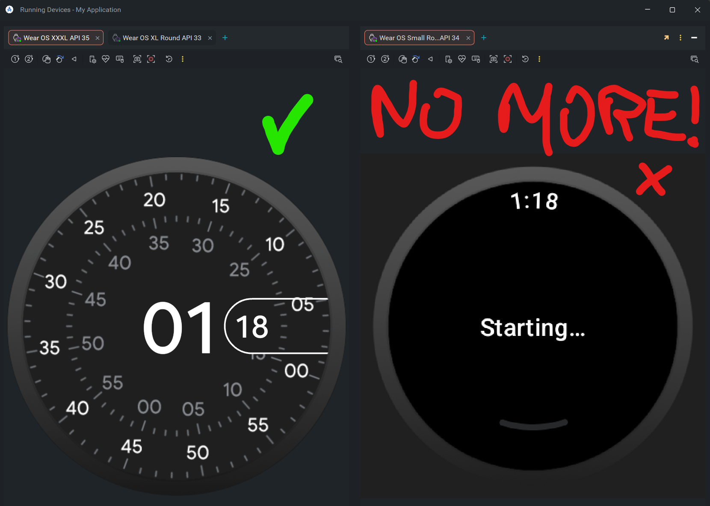

<div align="center">
  <a href="https://saderius.github.io/WearOS-Skin-Scaler/" target="_blank" rel="noreferrer noopener">
    
  </a>
</div>

# [Wear OS Skin Scaler](https://saderius.github.io/WearOS-Skin-Scaler/)

A small React app that generates Wear OS emulator skins from a single input value: screen resolution in pixels.

The app resizes high-quality PNG skin assets and updates the generated layout files so you can create emulator skins for different Wear OS devices with one simple input. It supports square watch skins and can load custom bezel files and masks, while defaulting to Turbo mode with predefined transparent bezels.

## What it does

- Accepts a single numeric input: target screen resolution in px
- Rescales high-quality Wear OS emulator skin PNG images
- Supports square watch skin generation
- Loads custom bezel files and mask assets for advanced skin creation
- Generates the matching Wear OS layout file automatically
- Lets you download a ready-to-use ZIP file for emulator skin deployment

## Features

- Single-value input for screen size
- High-quality image rescaling
- Square watch skin generation
- Custom bezel and mask file support
- Turbo default mode with predefined transparent bezels
- Layout file generation and modification
- Clean, device-style UI for Wear OS skin selection

## Run locally

**Prerequisites:** Node.js

1. Install dependencies:
   ```bash
   npm install
   ```
2. Start the app:
   ```bash
   npm run dev
   ```
3. Open the local URL shown in the terminal

## Build for production

```bash
npm run build
```

## Notes

- No special emulator configuration is required in the app
- The generated ZIP contains updated layout files compatible with Wear OS emulator skins